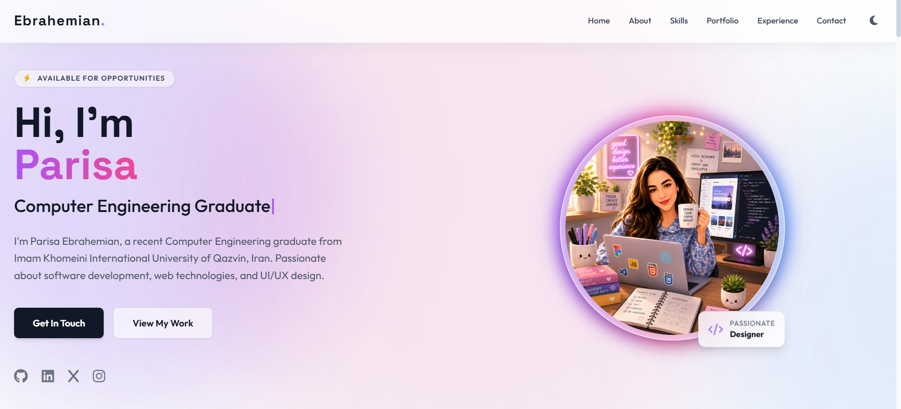

# 🚀 Parisa Ebrahemian - UI/UX Designer and Front End Developer Portfolio

> A modern, glassmorphism-inspired personal portfolio website built to showcase my software engineering projects, designer experience, and technical skills.



[](https://parisaeb04.github.io/my-designer-portfolio/)
[](https://pages.github.com/)
[](https://opensource.org/licenses/MIT)

---

## ✨ Features

- **Modern UI/UX:** Built with a premium glassmorphism aesthetic, smooth scroll animations, and 3D tilt interactions.
- **Fully Responsive:** Flawless layout scaling across desktop, tablet, and mobile displays.
- **Dark/Light Mode:** Seamless theme toggling with automatic user preference detection.
- **Functional Contact Form:** Serverless email integration using Formspree to handle inquiries directly from the static frontend.
- **Dynamic Interactive Elements:** Features a custom JavaScript-rendered animated favicon and typewriter effect.
- **High-Performance:** Lightweight, zero-dependency architecture ensuring lightning-fast load times.

## 🛠️ Tech Stack

- **Markup & Styling:** HTML5, Tailwind CSS, Custom CSS
- **Interactivity:** Vanilla JavaScript (ES6+)
- **Deployment & Hosting:** GitHub Pages
- **Typography:** Google Fonts (Outfit, Space Grotesk)
- **Form Handling:** Formspree API
- **Icons:** FontAwesome
- **3D Interactions:** Vanilla Tilt.js

# 🎨 Parisa Ebrahemian - UI/UX Designer & Front-End Developer Portfolio

> A modern, glassmorphism-inspired personal portfolio website built to showcase my UI/UX design projects, front-end development skills, and academic journey in Computer Engineering.


[](https://parisaeb04.github.io/my-designer-portfolio/)
[](https://pages.github.com/)
[](https://opensource.org/licenses/MIT)

---

## ✨ Features

- **Modern UI/UX:** Built with a premium glassmorphism aesthetic, smooth scroll animations, and 3D tilt interactions.
- **Fully Responsive:** Flawless layout scaling across desktop, tablet, and mobile displays.
- **Dark/Light Mode:** Seamless theme toggling with automatic user preference detection.
- **Functional Contact Form:** Serverless email integration using Formspree to handle inquiries directly from the static frontend.
- **Dynamic Interactive Elements:** Features a custom JavaScript-rendered animated favicon and typewriter effect.
- **High-Performance:** Lightweight, zero-dependency architecture ensuring lightning-fast load times.

## 🛠️ Tech Stack

- **Markup & Styling:** HTML5, Tailwind CSS, Custom CSS
- **Interactivity:** Vanilla JavaScript (ES6+)
- **Deployment & Hosting:** GitHub Pages
- **Typography:** Google Fonts (Outfit, Space Grotesk)
- **Form Handling:** Formspree API
- **Icons:** FontAwesome
- **3D Interactions:** Vanilla Tilt.js

## 💻 Local Development

To run this project locally on your machine:

1. **Clone the repository:**
   ```bash
   git clone https://github.com/parisaeb04/my-designer-portfolio.git

2. **Navigate to the directory:**
     cd my-designer-portfolio

3. **Launch a local server:**
    Right-click on index.html in VS Code
    Select Open with Live Server

4. **Open in browser:**
    Your browser will automatically open at http://127.0.0.1:5500/


## 🤝 Open Source & How to Use
    I believe in open-source learning! This portfolio template is completely open for anyone to use, copy, edit, and adapt for their own personal websites.

    If you want to use this design:

    Fork this repository to your own GitHub account.

    Update the index.html file with your own personal information, projects, and skills.

    Replace the images in the image/ folder with your own.

    Update the CSS files to match your preferred color scheme (optional).

    Note on Contact Form: The contact form is powered by Formspree. Remember to create your own free Formspree account and replace the await fetch("YOUR_ENDPOINT_HERE") link in the JavaScript file with your own endpoint so you receive the emails!

    Deploy for free using GitHub Pages, Cloudflare Pages, or Netlify!

    ⭐ A star on the repository is always appreciated if you found it helpful!

## 📫 Connect With Me
   Website: https://parisaeb04.github.io/my-designer-portfolio/

   GitHub: [github.com/parisaeb04](https://github.com/parisaeb04)

   Email: parisa.ebrahimian83@gmail.com


## 📄 License
    This project is licensed under the MIT License - see the LICENSE file for details.
